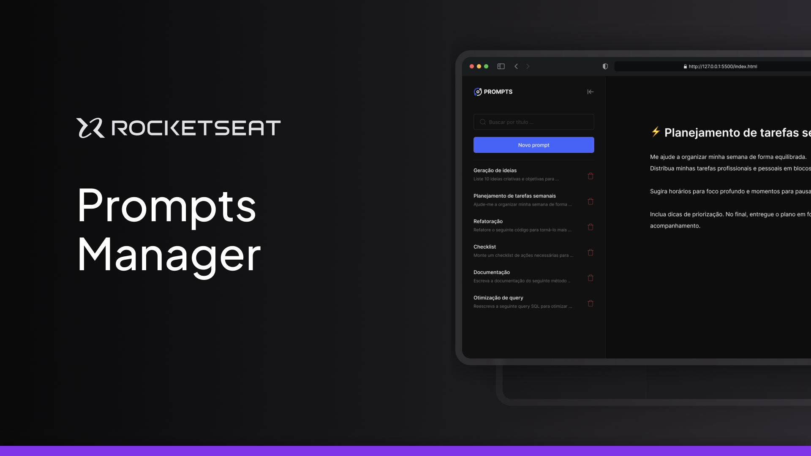
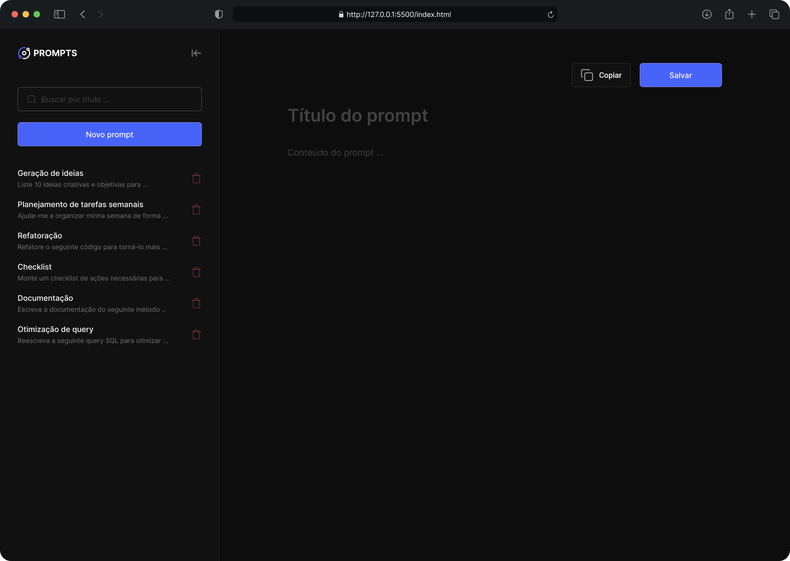

  

## ✨ Sobre o Projeto

Prompt Manager é uma aplicação web **prática e intuitiva** desenvolvida durante o bootcamp NLW Pocket com o objetivo de centralizar e gerenciar coleções de *prompts* (instruções) para modelos de Inteligência Artificial (como ChatGPT, Gemini, etc.).

* **Salvar, visualizar e editar** seus *prompts*.
* **Acessar rapidamente** seus comandos mais valiosos.

  

